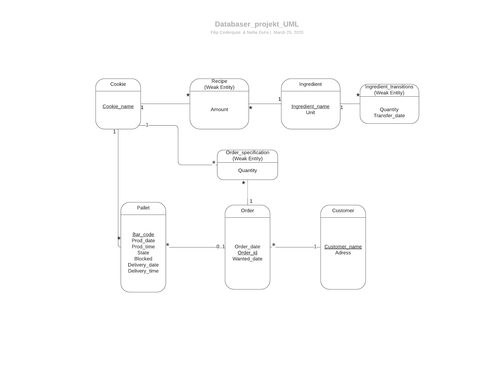

# EDAF75, project report

This is the report for

 + Filip Cederquist, `mat13fce`
 + Nellie Duhs, `tpi14ndu`

We solved this project on our own, except for:

 + The Peer-review meeting


## ER-design

The model is in the file [`er-model.png`](er-model.png):

<center>
    
</center>

The image above describes our suggested ER-model.


## Relations

The ER-model above gives the following relations (neither
[Markdown](https://docs.gitlab.com/ee/user/markdown.html)
nor [HTML5](https://en.wikipedia.org/wiki/HTML5) handles
underlining withtout resorting to
[CSS](https://en.wikipedia.org/wiki/Cascading_Style_Sheets),
so we use bold face for primary keys, italicized face for
foreign keys, and bold italicized face for attributes which
are both primary keys and foreign keys):

+ cookies(**cookie_name**)
+ recipes(amount,**_cookie_name_**, **_ingredient_name_**)
+ ingredients(**ingredient_name**)
+ ingredient_transitions(**transfer_date**, **quantity**, **_ingredient_name_**)
+ orders(**order_id**, order_date, wanted_date)
+ order_specifications(**_order_id_**, **_cookie_name_**)
+ pallet(**bar_code**, prod_date, prod_time, state, blocked, delivery_date, delivery_time, _order_id_, _customer_name_)
+ customer(**customer_name**, address)


## Scripts to set up database

The scripts used to set up and populate the database are in:

 + [`create-schema.sql`](create-schema.sql) (defines the tables), and
 + [`initial-data.sql`](initial-data.sql) (inserts data).

So, to create and initialize the database, we run:

```shell
sqlite3 krusty-db.sqlite < create-schema.sql
sqlite3 krusty-db.sqlite < initial-data.sql
```

(or whatever you call your database file).

## How to compile and run the program

This section should give a few simple commands to type to
compile and run the program from the command line, such as:

```shell
./gradlew run
```

or

```shell
javac -d bin/ -cp src src/krusty/Main.java
java -cp bin:sqlite-jdbc.jar krusty.Main
```

or, if you put your commands into a `Makefile`:

```shell
make compile
make run
```


